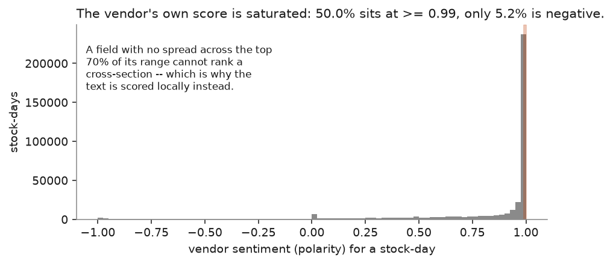
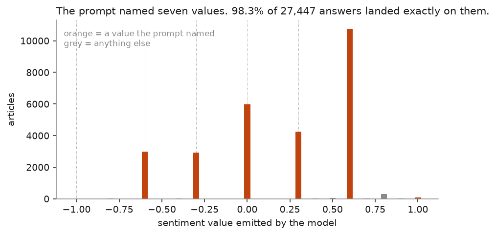
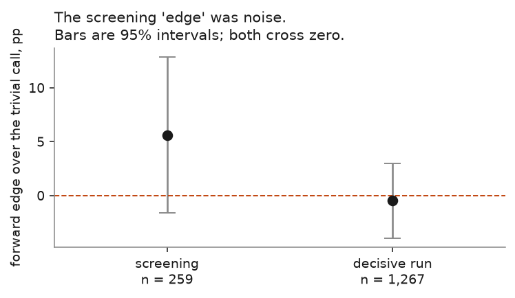
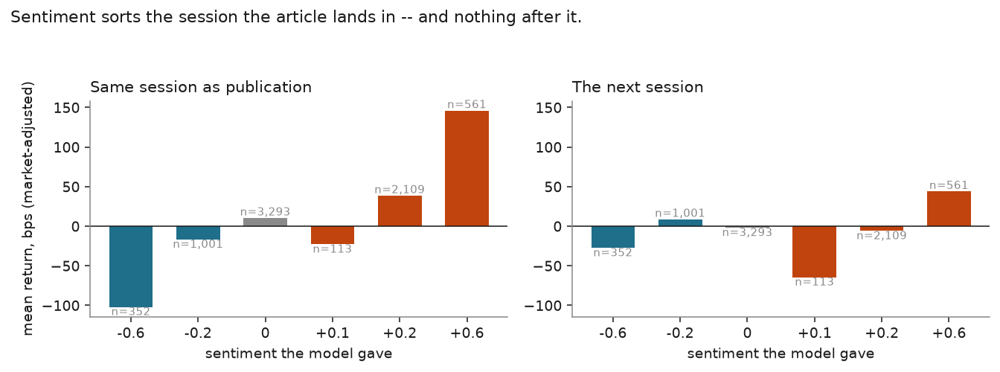
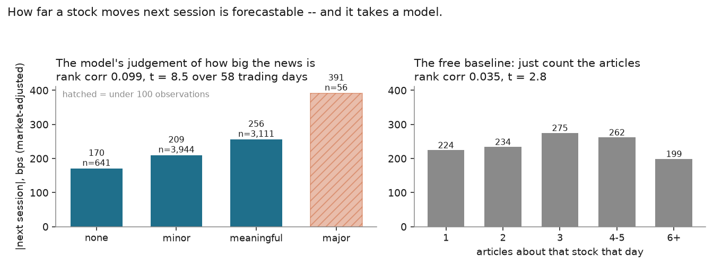

# datacli

**An interactive data-operations shell for market data** — download, refresh,
quality-check, explore and *score* raw provider snapshots from one colour-coded
terminal UI.

datacli turns a directory of raw parquet/CSV snapshots into a queryable, auditable
dataset. It ships a registry-driven acquisition toolkit for
[EODHD](https://eodhd.com) (prices, dividends, splits, fundamentals across US and
UK/EU equities, ETFs and indices, plus a global full-text **news corpus**), a macro
source (FRED + EODHD), a DuckDB-backed explorer, a local-LLM scoring engine for the
news text, an optional "Raw Data Lab", an MCP server, and one-way cloud backup —
all behind a single REPL with tab-completion.

```text
                                     EODHD status · as-of 2026-07-11 · stale >7d

 lane        dataset            last_data    coverage     fetched         rows   pairs   age   flag      state
 ────────────────────────────────────────────────────────────────────────────────────────────────────────────
 us_common   ● prices           2026-07-08   2026-07-08   07-09 11:06   12.66M   2,595    3d   ✓ ok      ok 2,593 · empty 2
             ● dividends        2026-07-09   2026-07-09   07-09 07:50   168.7K   2,595    2d   ✓ ok      ok 1,895 · empty 700
             ● splits           2026-07-07   2026-07-08   07-08 19:33     5.9K   2,581    3d   ✓ ok      ok 1,879 · empty 702
             ● fundamentals_q   2026-07-02   -            07-08 19:33    1.21M   6,124    9d   ⚠ STALE   ok 5,895 · empty 229

3 fresh · 1 stale · 0 absent · ≈14.05M rows across 4 datasets
```

**Two things it does that most data tools don't:** it measures *freshness against
the right anchor per dataset kind* (last bar for prices, query coverage for events,
latest filing for fundamentals, last crawled day for news), and it treats
**scoring the news text as a measurable engineering problem** rather than a demo —
the results of which are the second half of this README.

---

## Highlights

- **One shell, every operation** — a cmd2 + Rich REPL with source contexts,
  tab-completion, and slash-optional commands (`qc` == `/qc`).
- **Registry-driven** — lanes and datasets live in one registry; add an entry and
  `status`, `refresh`, `lanes` and the explorer all pick it up.
- **Actionable QC** — triage that flags structural issues *and names the fix*
  (`targeted_rerun` vs `full_refresh`).
- **Ask questions, not SQL** — `describe` / `find` / `rows` / `coverage`, with `sql`
  as the escape hatch, over a warm DuckDB connection.
- **Schema-versioned** — projected views NULL-fill or rename-alias columns so
  queries survive provider schema drift.
- **A news corpus you own** — 4.5 M full-text articles (2019→) with symbol tags,
  stored as daily parquet partitions, plus derived symbol- and issuer-grain panels.
- **Local scoring** — a pluggable, schema-driven engine that extracts structured
  records from article text with an Ollama model. No API cost, nothing leaves the box.

## Install & quickstart

```powershell
uv sync --extra dev

# point at your data (writes datacli.toml, git-ignored), index it, ask something
uv run python eodhd/cli.py config set data-root "D:\data\raw\eodhd"
uv run python eodhd/cli.py reindex
uv run python eodhd/cli.py describe AAPL.US
```

Starting from an empty data root needs a *first fill*, and its order matters — the
price/event fetchers read a coverage file that only the fundamentals stage writes:

```powershell
$env:EODHD_API_KEY = "<your key>"
uv run python eodhd/cli.py refresh us_common uk_eu --datasets fundamentals --run
uv run python eodhd/cli.py refresh us_common uk_eu --run
uv run python eodhd/cli.py refresh us_etf index_ref uk_eu_etf uk_eu_index_ref --run
uv run python eodhd/fetch_eodhd_news.py --dry-run   # estimate first; crawls nothing
uv run python eodhd/fetch_eodhd_news.py             # ~3 h, ~7 GB, ~28k units
```

Budget roughly **two quota-days and several hours** for a full first fill. Every
fetcher is resumable — re-run the same command. Then the routine is
`refresh --fast --run` daily and `refresh --datasets fundamentals --run` weekly.

The shell wraps all of it:

```powershell
uv run python datacli.py
```

```text
data>  source eodhd             # enter a source context -> eodhd>
eodhd> status us_common         # colour-coded as-of dashboard, scoped to a lane
eodhd> fetch --fast --run       # bulk top-up (minutes, not hours) + news top-up
eodhd> qc us_common splits      # quality triage, drilled into one dataset
eodhd> describe VAR.OL          # everything known about one ticker
```

## Lifecycle

`$` = hits the paid EODHD API. Everything else runs offline against your snapshot.

| stage | what you run |
|---|---|
| **1. setup** | `config set data-root <path>` · set `EODHD_API_KEY` · `lanes` |
| **2. first fill** `$` | `refresh … --datasets fundamentals --run` → `refresh --run` → `fetch_eodhd_news.py` |
| **3. routine** `$` | `refresh --fast --run` daily · `refresh --datasets fundamentals --run` weekly |
| **4. verify** | `status [lane]` · `qc [lane] [dataset]` |
| **5. index** | `reindex` — run it after every fetch |
| **6. explore** | `describe` · `find` · `rows` · `coverage` · `sql` |
| **7. score** | `score plan` → `score run --run` → `score panel-eval` |
| **8. ask** | `ask` · `agent` · `investigate` · `lab run` (optional LLM lab) |
| **9. back up** | `sync` → `sync push --run` |

Full command reference, configuration keys and architecture:
**[`docs/REFERENCE.md`](docs/REFERENCE.md)**.

---

# What we measured

The news corpus exists to answer one question: **does news text predict what a
stock does next?** The scoring engine (`scoring/`) extracts a structured record per
article with a local model, and everything below was measured on the result. The
figures regenerate from the local store with `uv run python docs/make_figures.py` —
nothing here is illustrative.

The honest summary: **we did not find a directional signal, we did find a magnitude
one, and most of the work was learning to tell the difference from noise.**

### 1. The vendor's own sentiment score is unusable

The starting plan was to use the sentiment the data provider already ships. It has
no spread across the top 70 % of its range — half of all stock-days sit at ≥ 0.99
and only 5 % are negative — so it cannot rank a cross-section at all.



That is what motivated scoring the text ourselves.

### 2. An LLM copies whatever numbers you put in the prompt

The first schema asked for a sentiment float and named seven example values to
anchor the scale. **98.3 % of 27,447 answers came back as exactly one of those seven
numbers.** Ask for a calibrated number and you get the prompt's numbers back.



The fix is to stop asking for numbers: the schema asks for an **ordinal label** and
code maps labels to floats. On the axis that matters this was worth a lot — on
1,267 identical articles, switching from numeric anchors to labels took the impact
field from a rank correlation of 0.058 to 0.084 and from non-monotone to perfectly
monotone, a **5× larger spread**.

This effect is asymmetric, which is worth knowing if you write these prompts:
stating a base rate reliably pushes answers *down* (three schema revisions pushed
"most articles are low-impact" and the low share went 0.59 → 0.78 → 0.89), but
telling the model that the top level "is NOT a rare-exception label" did **not**
push answers up. It stayed at 0.3–0.5 % across three wordings.

### 3. Small samples lie, loudly

A 259-article screen picked a model showing a **+5.6 pp** forward edge. Re-run on
1,267 articles, the same model on the same schema scored **−0.5 pp**. Nothing was
wrong with either measurement — the screening standard error was 3.7 pp, so the
result had always been noise, and the ranking built on it was arbitrary.



Five different local models (7B–14B, Qwen / Llama / Phi) **agreed on direction
95.6 % of the time** on articles where both committed. When two models make the
same call on 96 % of inputs, no sample size available on one GPU can separate their
directional skill — so model choice was settled on the things that *are* precisely
measured: schema-fill quality and cost.

### 4. Direction: the model reads the session it's in, and nothing after it

Sentiment sorts the return of the session the article lands in, cleanly and
monotonically. On the **next** session the ordering is gone.



Put as one number, over 58 trading days: sentiment's rank correlation with the
**same** session's return is 0.10 (t = 6.3); with the **next** session's it is
−0.002 (t = −0.11, p = 0.92). It has an unglamorous explanation — much of what the
model "predicts" is a move the article itself already reports ("shares fell 8 %
after…"). Confirmed independently on a vendor-signal quintile long-short over
**2,564 trading days** (t = 1.27) and a per-article edge over 803 committed rows
(p = 0.78). Every significant direction number is contemporaneous.

This is roughly what an efficient market should look like. Public news sentiment
against next-day returns is one of the most competed-away signals there is; finding
nothing is the default expectation, not a failure.

### 5. Magnitude: *how far* a stock moves is forecastable — and it needs the model

Ask the model how *big* the news is, and the answer orders the next session's
absolute move monotonically across every level. The free baseline — just counting
how many articles a stock drew that day — is nearly flat over the same rows.



| signal | rank corr with \|next-session move\| | t (over trading days) |
|---|---|---|
| model's materiality judgement | **0.099** | **8.5** |
| article count (free, no model) | 0.035 | 2.8 |

Measured over 58 trading days, market-adjusted, with a per-day rank correlation and
a Newey–West correction for overlapping windows. It first appeared on 15 days
(t = 6.1), replicated on a 4× larger sample (t = 6.9), and improved again when the
schema was tuned to spread the scale (t = 8.5) — while the free baseline stayed
flat throughout, which is the control that says the gain is in the model's
judgement and not in the data. Article counting does win the *same* session —
attention tracks today's move, t = 15.3 over 2,215 days — but has nothing forward.

So the deliverable is an **event-driven magnitude / volatility feature**, not an
alpha signal: useful for position sizing, risk, and options screens.

### 6. The measurement was harder than the model

Every one of these bugs produced a confident, plausible, wrong answer, and each was
found only by asking why a number looked odd:

| bug | what it did |
|---|---|
| abstentions scored as losses | a model answering "neutral" on 54 % of articles "lost" a head-to-head 2–47, purely for declining to call |
| edge measured on the publication session only | rewarded hindsight on articles that report the move themselves |
| base rate drawn from *all* rows | a config that only committed on rows that rose scored a +50 pp "edge" for having a filter, not skill |
| ties broken by row order | produced **t = 4.87** from a field with no dispersion at all |
| overlapping return windows | a 20-day result at t = 4.01 was t = 2.12 once autocorrelation was handled |
| rounding a decimal field to integers | collapsed five levels to one and returned *nothing*, silently |

The pattern worth generalising: **a measurement harness needs adversarial tests as
much as the code does.** Each fix is pinned by a test that fails on the old
behaviour — 428 tests in total.

### Limits

One provider, one price venue per name, ~5 years of news and an 87-day scored
window (58 trading days with usable forward returns). Returns are close-to-close and market-adjusted by an exchange median, with
no transaction costs, borrow, or liquidity screen. Correlations of 0.08 are real
but small. **None of this is investment advice**, and it is not a backtest — it is a
measurement of whether a feature carries information.

One caveat we could not fix: the top impact level (`major`) lands on well under 1 %
of articles no matter how the prompt is worded — three attempts moved it between
0.1 % and 1.5 %. The correlations above hold regardless, because they use every
level, but a strategy that trades only the top bucket would be working with a
handful of names per day.

The full working record, including the dead ends, is in
[`eodhd/NEWS_SCORING_DESIGN.md`](eodhd/NEWS_SCORING_DESIGN.md).

---

## Docs

| | |
|---|---|
| [`docs/REFERENCE.md`](docs/REFERENCE.md) | every command, config key, architecture |
| [`eodhd/README.md`](eodhd/README.md) | the EODHD lanes in detail — run order, resume semantics |
| [`eodhd/NEWS_SCORING_DESIGN.md`](eodhd/NEWS_SCORING_DESIGN.md) | the scoring design and the full experimental record |
| [`eodhd/NEWS_ROADMAP.md`](eodhd/NEWS_ROADMAP.md) | what is built and what is next |
| [`eodhd/EODHD_NEWS_SENTIMENT_FINDINGS.md`](eodhd/EODHD_NEWS_SENTIMENT_FINDINGS.md) | what the provider's news endpoints actually expose |

## Development

```powershell
uv sync --extra dev
uv run pytest -q
```

Provider data is EODHD's and subject to their licence; this repository contains
code and documentation only, no vendor data. MIT licensed.
